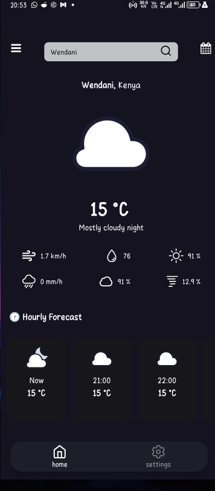
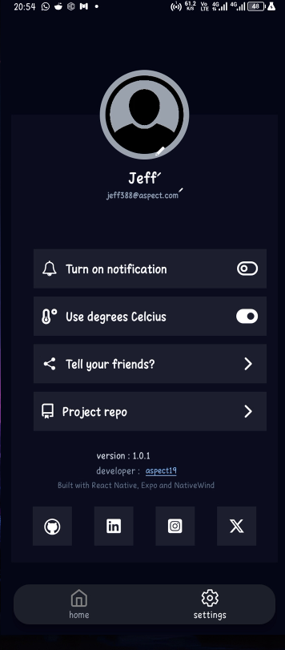

# Weather App

Welcome to the Weather App! 🌤️ This app provides real-time weather updates and forecasts, offering a simple and intuitive interface.


## Features

- Current weather information (temperature, humidity, wind speed, etc.).
- 7-hour weather forecast.
- Location-based weather (using  search by city).
- Responsive and intuitive design for mobile devices.
  
## Previews

<div  style="display:flex; gap: 15px; flex-wrap: wrap">
   
   
   
</div>

## Installation

To run the Weather App locally, follow these steps:

1. Clone the repository:

   ```sh
   git clone https://github.com/aspects19/weather-app.git
   ```

2. Navigate into the project directory:

   ```sh
   cd weather-app
   ```

3. Install dependencies

    ```sh
    npm install
    ```

4. Start app

   ```sh
   npm start
   ```

5. Scan the QR code on the terminal on Expo Go App on your phone.
6. 🎉 Your app is up and running. View it on Expo Go mobile app .

## Building the app

You can download the prebuild apk of this app from [Releases](https://github.com/aspects19/weather-app/releases) section or build it from the sorce code as shown earlier.

## Contributions

If You wish to make contributions to this project such as reporting issues and bugs, fixing them and adding features, take a look at [contribution guide](https://github.com/aspects19/weather-app/CONTRIBUTING.md)

## License

This project is licensed under the MIT License – see the [LICENSE](https://github.com/aspects19/weather-app/blob/main/LICENSE) file for details.

##

Thanks for checking out the Weather App! 🌦️ Feel free to open issues, fork the repository, or contribute to making it even better!
